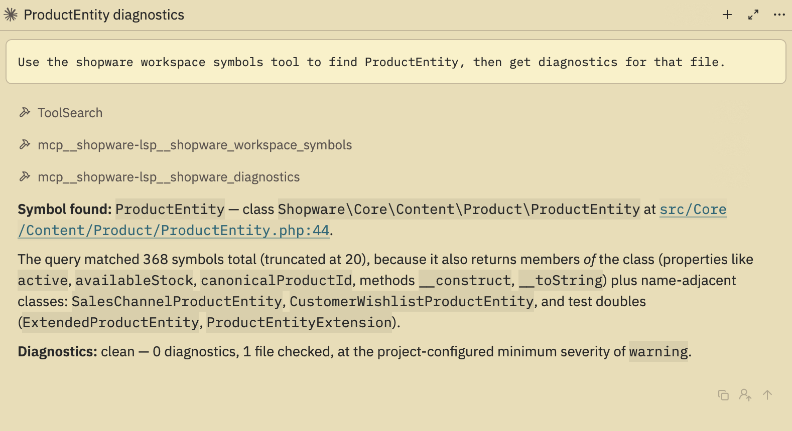

# Agent Panel tools (MCP)

The language server also speaks MCP, so Zed's Agent Panel can query the
same index the editor uses.



The extension also registers the server's MCP endpoint as a context server, so
Zed's Agent Panel gets the same 16 Shopware tools the VS Code extension
contributes: `shopware_diagnostics`, `shopware_hover`, `shopware_definition`,
`shopware_references`, `shopware_workspace_symbols`, `shopware_code_actions`,
`shopware_apply_code_action`, `shopware_scaffold`, `shopware_scaffold_catalog`,
and the seven `shopware_entity_schema_*` tools.

Nothing to install: it reuses the same binary as the language server.

Left alone, the extension resolves the MCP binary from whatever the language
server already resolved, then from a managed download. It cannot look on
`PATH`: `context_server_command` receives a `Project` rather than a `Worktree`,
and Zed's wasm sandbox is given no `PATH` variable.

That carry-over needs the language server to have started first, so opening the
Agent Panel before a PHP file leaves the agent on the managed download while
the editor runs whatever `lsp.shopware-lsp.binary.path` points at. Check with
`ps | grep shopware-lsp` that the language server and the `mcp` process are on
the same path; otherwise the Agent Panel answers from a different build than
the editor.

To force a specific binary, set `command` -- **and set `args` with it**:

```json
{
  "context_servers": {
    "shopware-lsp": {
      "command": {
        "path": "/Users/you/.local/bin/shopware-lsp",
        "args": ["-root", "/path/to/shopware", "mcp"]
      }
    }
  }
}
```

`args` is not optional here. Zed treats a present `command` as a complete
custom-server definition and never calls `context_server_command`, so the
extension's argument building never runs and the binary is spawned bare. That
is a stdio language server being asked to speak MCP: it fails with a 30 second
timeout and no useful error, and its command line then looks identical to the
language server's, so `ps` cannot tell them apart. `mcp` must come last, since
the server rejects trailing global flags.

For the same reason, `command` and the `root` setting below are mutually
exclusive: pinning `command` makes `settings.root` dead config, and the root
has to be passed as `-root` in `args`.

`shopware-lsp mcp` refuses to start outside a Shopware or Symfony project, and
Zed's `Project` handle exposes worktree IDs but no paths, so the root is taken
from the `root` setting first, then from whatever the language server last
reported, and only then left to the process working directory. Pin it for
multi-root workspaces:

```json
{
  "context_servers": {
    "shopware-lsp": {
      "settings": { "root": "/path/to/shopware" }
    }
  }
}
```

Zed intends to deprecate MCP server extensions in favour of the official MCP
registry ([zed#59351](https://github.com/zed-industries/zed/issues/59351)). If
that lands before this is rewritten, the same server still works as a custom
context server pointed straight at the binary.

---

[Back to the README](../README.md)
