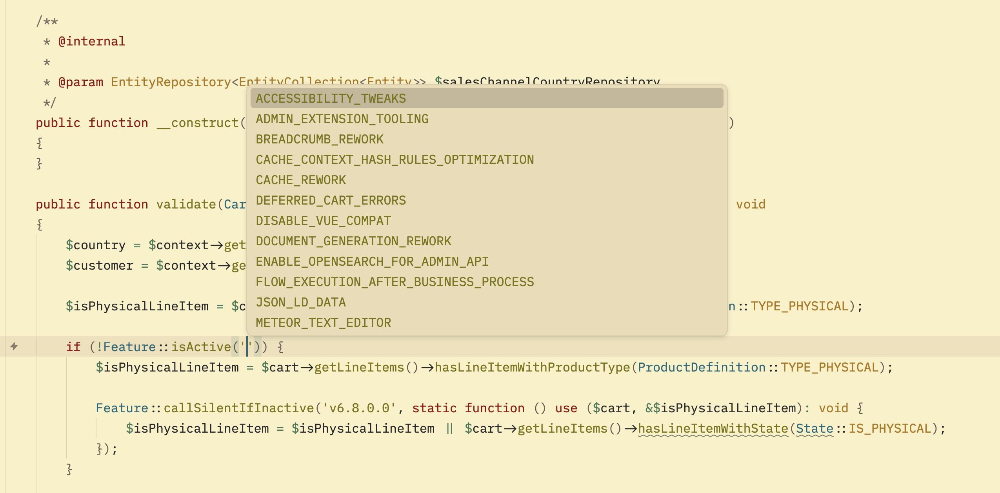
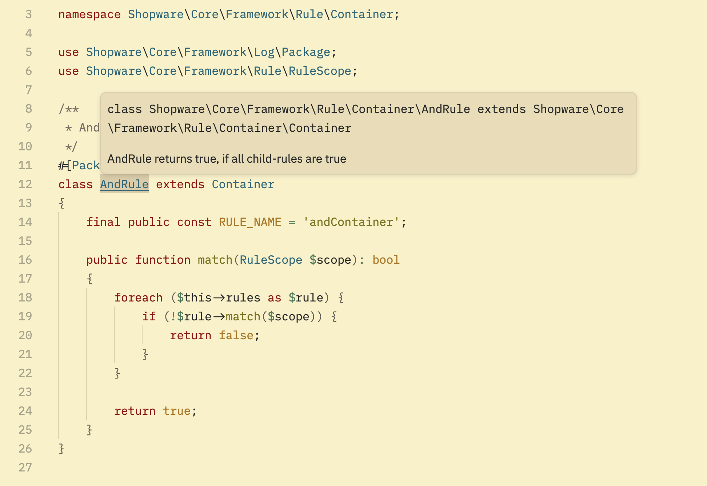
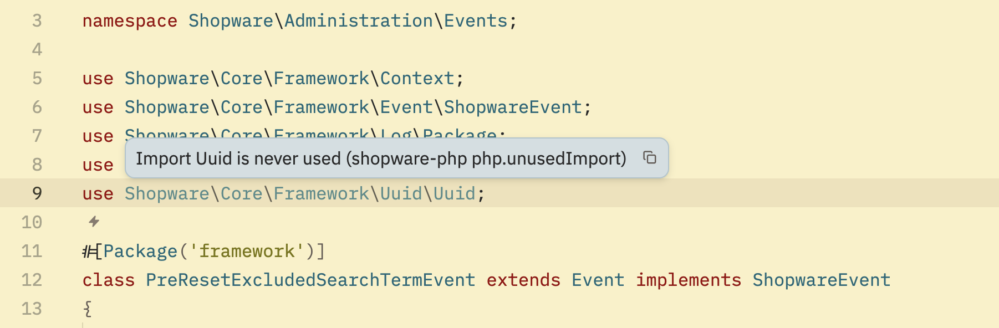
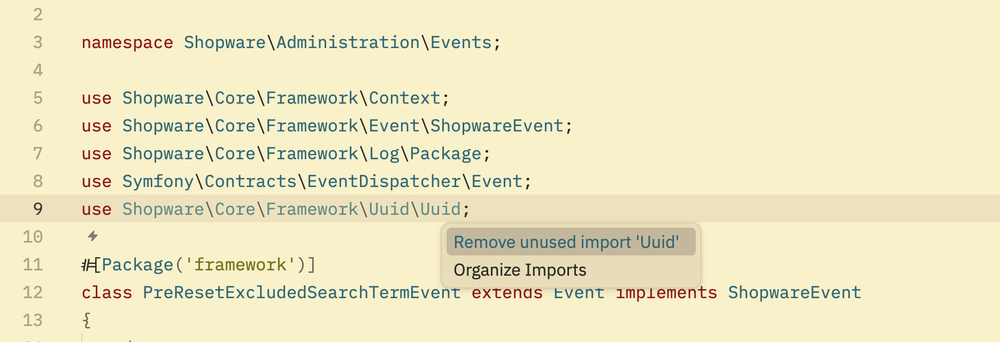
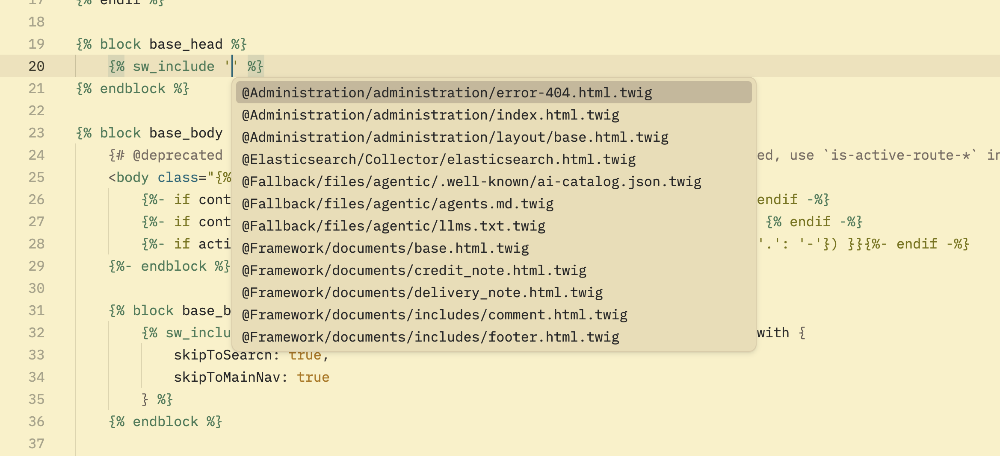
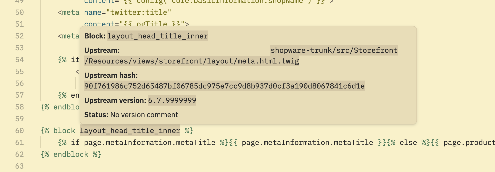
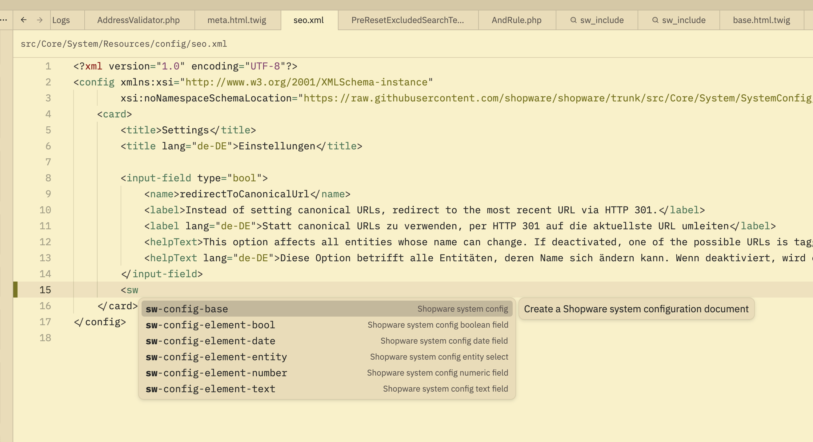
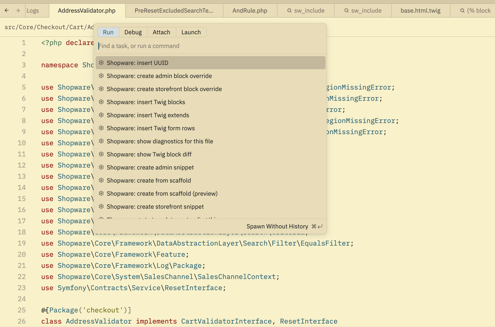
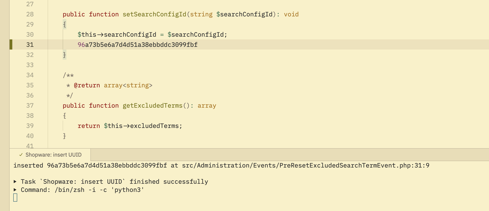

# Features, one at a time

What each feature does, how to reach it, and where it stops. Screenshots are
from a `shopware/shopware` trunk checkout.

If a feature here does nothing for you, check
[troubleshooting.md](troubleshooting.md) before assuming it is broken — most of
the silent failures have a known cause.

## Completion

Type, and the server offers what belongs in that position. It knows Shopware,
not just PHP: feature flags, service ids, route names, system config keys,
snippet keys, entity and field names, Twig templates, blocks, filters and
functions.

Inside `Feature::isActive('')` you get the flags the project actually defines,
read from `src/Core/Framework/Resources/config/packages/feature.yaml` — not a
hardcoded list.

Completion triggers on its own after `'`, `"`, `::`, `.`, `@`, `%` and a dozen
other characters. There is no need to press anything. If you want a manual
trigger, `editor: show completions` from the command palette works;
`ctrl-space` is the default binding but is commonly stolen by macOS input
switching or another app, in which case Zed never sees it.

Two things worth knowing:

- **PHP member completion works, general PHP intelligence does not.** The
  server resolves members off a class it has indexed, but it is not a
  replacement for phpactor or Intelephense. See
  [Running alongside another PHP server](internals.md#running-alongside-another-php-server).
- **Completion is only as good as the index.** A class the server has not
  indexed yet, or one whose import is missing, resolves to nothing.

## Hover

Hover any symbol for its signature and documentation.

Classes show their fully qualified name, what they extend and implement, and
the docblock summary if there is one. A class without a docblock shows the
signature alone — that is the whole answer, not a failure.

Hover also answers for Twig blocks, service ids, route names, config keys and
feature flags, each with what the server knows about that particular kind of
thing.

## Go to definition

`f12`, or `editor: go to definition`. Works across the boundaries that
normally break navigation in a Shopware project: PHP class to PHP class, a
service id in XML or YAML to the class implementing it, a Twig template path to
the file, a block name to where it is defined upstream.

## Diagnostics

Problems appear as you edit, from the server's own inspection set.

The hover names the rule (`shopware-php php.unusedImport`), which is what you
need to silence it in `.config/shopware/lsp.yaml`.

**Unused imports do not get a squiggle.** They are sent at severity `Hint`
tagged `Unnecessary`, so Zed fades the text instead of underlining it. That is
the same convention gopls, rust-analyzer and TypeScript use, and it is easy to
read as "diagnostics are not working". Turn on `diagnostics.inline` in your Zed
settings if the fade is too subtle.

Diagnostics that reference services or parameters need Symfony's dev debug
container dump. Without it, every reference looks unresolvable — see
[Thousands of "Service ... not found"](troubleshooting.md#thousands-of-service--not-found-or-parameter--not-found).

## Code actions and quick fixes

`editor: toggle code actions` on a diagnostic or a selection.

`Organize Imports` sorts and prunes the whole `use` block. The
`Remove unused import '...'` quick fix takes out one line, leaving the others
alone. Extract-variable and extract-method are offered on expressions.

If you see every entry twice, a second PHP language server is enabled
alongside this one. That is a settings problem, not a bug —
[Code actions and completions appear twice](troubleshooting.md#code-actions-and-completions-appear-twice).

The *generator* code actions from the VS Code extension — scaffolding, Twig
block overrides, snippet creation — cannot be offered here at all. They are
reachable as tasks instead: see [tasks.md](tasks.md).

## Twig

Template paths complete from the project's own template index, bundle
namespaces included.

Block names complete the same way, and hovering a block tells you where it
comes from.

For a block that overrides another, the hover resolves the upstream template,
its hash and version. `Status: No version comment` here is not an error — it
means the override carries no `@sw-package`-style version comment, which is
what the block-diff feature needs to tell you whether upstream has changed
underneath you.

**`.twig` files need Zed's Twig extension installed.** Without it those files
have no language id and the server never attaches. Check the status bar reads
exactly `Twig`.

That extension also ships its own language server, so `.twig` files get two
and you see the union of what both report. If a Twig diagnostic looks wrong —
`Unexpected syntax` on a core template, say — it is probably the other one:
see [Twig syntax errors on core
templates](troubleshooting.md#twig-syntax-errors-on-core-templates-or-duplicate-twig-diagnostics).

## Snippets

Shopware's XML config snippets, ported from the VS Code extension.

Type `sw-config-` in an XML buffer for the six `sw-config-*` entries with their
descriptions. Choice placeholders work: `sw-config-element-text` offers
`text`, `textarea`, `password` and `url` as a pick list, though Zed sorts them
alphabetically rather than in snippet order.

## Generator tasks

The VS Code extension's generators are code actions. Zed's code-action menu
cannot host them, so they run as tasks instead.

Install them once with `./install-tasks.sh` and they are available in every
project. Full list and behaviour in [tasks.md](tasks.md).

## Agent Panel tools

The same server also speaks MCP, so Zed's Agent Panel gets 16 Shopware tools —
diagnostics, hover, definitions, references, workspace symbols, code actions,
scaffolding, and the DAL entity-schema workflow.

Nothing extra to install: it reuses the same binary. Setup and the pitfalls
around pinning it are in [agent-panel.md](agent-panel.md).

---

[Back to the README](../README.md)
